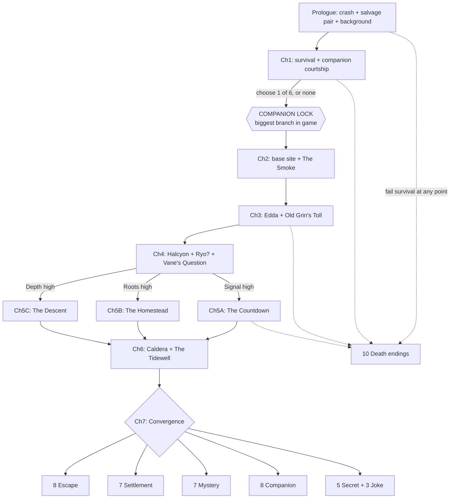

# 02 · Story & Branching Structure

## Story summary (spoilers — this is the writers' bible)

A small charter plane crossing the far Pacific loses instruments in clear weather — the
compass spins, the radio fills with a low choral **Hum** — and goes down beside an island
that no chart admits exists. The player washes ashore as (so far as they know) the sole
survivor.

The island is enormous, lush, and wrong in small ways: compasses lie, radios drown in
the Hum, and at night the lagoon glows. Surviving the first days, the player crosses
paths with several wild animals and may spend precious early hours earning the trust of
**one** of them — the game's defining decision.

Exploring inland, the player finds layer upon layer of arrivals who never left: a
Portuguese treasure wreck; terraced ruins of the **Kaari**, a seafaring people who
"vanished" centuries ago; and **Station Halcyon**, a 1970s research outpost abandoned
mid-breakfast. Halcyon's journals (Dr. Ilsa Vane) reveal the truth of the Hum: a vast
piezoelectric mineral seam — **heartglass** — threaded through the volcano and charged
by tidewater surging through sea-caves. It bends magnetism and radio for fifty miles.
The island doesn't just happen to be uncharted. It *hides*.

The player also finds **Edda Voss** — Halcyon's botanist, now in her seventies, the only
researcher who stayed when the project fell apart — living as a hermit and, in her own
cranky way, as the island's caretaker. Through her (and through thirty carved glyph
stones) the deeper history opens: the Kaari never vanished. When the volcano tore the
island in the 1600s ("the Sundering"), they withdrew into the caldera's hidden valley,
the **Inner Green**, and kept a covenant: tend the island, and let the Hum keep the
world away. A young Kaari scout, **Naia**, has been watching the player since day one.

Meanwhile the practical story grinds on: monsoon season is coming; a second survivor
(**Ryo Nakata**, a solo sailor the Hum reeled in) may wash up; the apex beasts — the
scarred **Boar King** inland and the crocodile **Old Grin** in the mangroves — contest
the player's expansion; and every day is still hunger, water, fire, weather.

By the final chapters the player's accumulated life on the island — the route points —
poses the real question. **Signal:** the world is out there; a radio can be rebuilt, a
boat repaired, a pyre lit. **Roots:** a life is *here*; a homestead, maybe a village,
maybe Edda's mantle. **Depth:** the island has a heart, a door under the temple, a
people in the caldera, and a choice about what the Hum should be. The companion — who
they are, what they fear, what they'd give up — colors every one of these roads, and the
48 endings resolve the player's hundred days into one of them.

## The three routes

Route points accumulate from dozens of choices. No point is ever "wasted" — mixed
profiles unlock hybrid endings.

| Route | Point | Fed by | Chapter-5 variant | Flagship endings |
|---|---|---|---|---|
| **Escape** | Signal | Salvage, signal-building, radio/raft work, refusing to settle in | *The Countdown* | E1–E8 |
| **Settler** | Roots | Building, farming, naming places, feasts, helping Ryo/Edda nest | *The Homestead* | S1–S7 |
| **Mystery** | Depth | Ruins, glyphs, Halcyon files, temple, siding with the island | *The Descent* | M1–M7 |

## Chapter structure

Each chapter lists its fixed spine, its major Threshold(s), and what varies.

### Prologue — *Falling* (Day 0)
Playable crash sequence. Character background chosen in flashback. **Threshold — The
Sinking Fuselage:** the plane slips off the reef shelf in minutes; the player can save
**two** of five salvage bundles (flare gun / med-kit / toolbox / rations & tarp / the
locked courier case + a stranger's photograph). Every bundle matters in at least two
later chapters; the courier case is a slow-burn secret (see Endings X2).

### Chapter 1 — *The First Fire* (Days 1–3)
Water, fire, shelter tutorialized as drama. Wildlife sightings seed the companion
choice: each candidate animal has a distinct **first encounter** (Kavi watches from the
treeline; Ipo steals the player's only lighter; Vela drops a half-eaten fish at their
feet; Buri raids the camp; Moa's flock panics at a hawk; Nine's tide-pool arm-wave is
easy to miss entirely). **Threshold — The Clearing of Eyes (Day 3):** the player commits
their scarce time to pursuing **one** animal's trust — or none (Solo route, its own
scenes and endings). This is the single largest branch in the game; see
[03-companions.md](03-companions.md).

### Chapter 2 — *Foothold* (Days 4–14)
Base site selection (beach / jungle fringe / cliff overhang — each with real tradeoffs:
tide risk vs. bug-borne disease vs. water hauling). First storm. First trust arc beats.
The Boar King wrecks something the player built — establishing the antagonist. Smoke
seen rising far inland (Edda — but the player doesn't know that). **Threshold — The
Smoke:** investigate now (dangerous, early Edda contact, Depth+) or fortify first
(safer, Roots+, Edda relationship starts colder).

### Chapter 3 — *The Green Deep* (Days 15–30)
The jungle interior, the Silverthread river, the mangrove maze (Old Grin's domain),
first ruins. Edda encountered properly — as rescuer, patient, or shotgun-wielding
recluse depending on Ch2 flags and companion (she despises Ipo on sight; respects Kavi;
melts, privately, for Moa). Companion heart scene #1 window. **Threshold — Old Grin's
Toll:** the mangrove shortcut to the island's east half requires dealing with the
crocodile — bait it, fight it (injury near-certain), map a long detour (time), or — with
specific companions — outwit it.

### Chapter 4 — *The Hum* (Days 31–50)
Station Halcyon opens: generators, the radio husk, Vane's journals, the Incident.
The mystery becomes explicit. **Conditional event — The Second Survivor:** if the
player's signal infrastructure ≥ 2 (fires/flags/mirror), Ryo's crippled sailboat is
drawn in; he arrives injured and becomes ally, dependent, or friction depending on
choices (he is Signal-aligned and will push escape). **Threshold — Vane's Question:**
the journals end with a sealed drawer and a choice: pry into the Incident files (Depth+,
Edda furious if she learns; unlocks the Gullet route) or leave the dead their privacy
(Edda trust++, Hope+, files lost unless revisited with her blessing later).

### Chapter 5 — *The Long Rain* (Days 51–70) — **three variants**
Monsoon. The survival crucible; companion fear arcs peak here (Moa's storm terror,
Vela grounded and vulnerable, Kavi's fire panic during the lightning fires).
- **The Countdown (Signal-dominant):** race to seaworthiness/radio before the storms
  close the season; rationing; a brutal choice between raft materials and shelter repair.
- **The Homestead (Roots-dominant):** the farm, the flood, the granary; defending the
  settlement from the desperate, storm-starved Boar King; Edda winters over; feast scene.
- **The Descent (Depth-dominant):** the flooding Gullet caves open only in monsoon
  surge-lulls; glyph hunt; first contact with Naia mid-chapter — the island's watchers
  reveal themselves to a player the island has come to regard.

### Chapter 6 — *Ashes and Stairs* (Days 71–90)
The caldera. The Terrace of Steps, the Tidewell Temple, and — if regard and flags allow —
the Inner Green and the Kaari. The full truth of the Sundering, the covenant, and what
Halcyon's Incident actually was (they drilled the heartglass; the island answered).
The volcano stirs (scripted tremors — severity scales with how much the player/Halcyon
legacy has wounded the seam). **Threshold — The Tidewell:** the player stands where
every guardian has stood and learns the three doors: *silence the Hum* (the world will
find the island), *feed the Hum* (the island stays hidden — and so does everyone on it),
or *become its keeper* (the covenant passes to you). Choosing here requires prices paid
earlier; unqualified players get a colder version of Chapter 7.

### Chapter 7 — *Convergence* (Days 91–100)
Endgame. The player's route profile, Trust tier, alive/dead cast, and Tidewell choice
resolve into an ending from [09-endings.md](09-endings.md). Every ending gets a written
epilogue that name-checks specific Ledger flags (the game proves it remembers).

## Branch architecture

**How divergence compounds:** the companion is an *overlay*, not a fourth route — every
chapter has companion-conditional scenes, alternate solutions to Thresholds (Ipo can
steal Old Grin's bait-fish; Vela can spot Ryo's boat a day early; Buri can breach the
Halcyon storeroom; Nine can reach the drowned radio room), and exclusive quests. Route ×
companion × Threshold flags means Chapter 5 alone ships in 3 variants × 7 companion
states — the design accepts heavy authoring here because Ch5 is the emotional peak.

**The Ledger (flag policy):** flags are write-once and never garbage-collected. Epilogue
text is assembled from Ledger queries, so even a Day-2 kindness (freeing the gull from
the net) can earn a line on Day 100.

**Failure is canon:** death endings are real endings with full epilogue cards and Ledger
reports, and each teaches a system (die of thirst once, and the next run's water scenes
read differently — some death epilogues even hint at secrets: D4's last line mentions
lights deeper in the cave).
